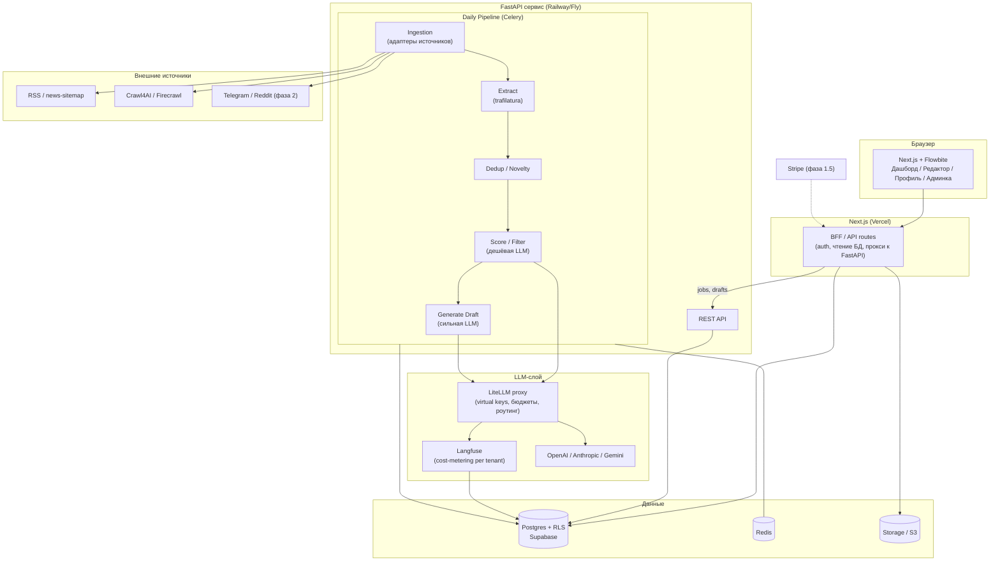
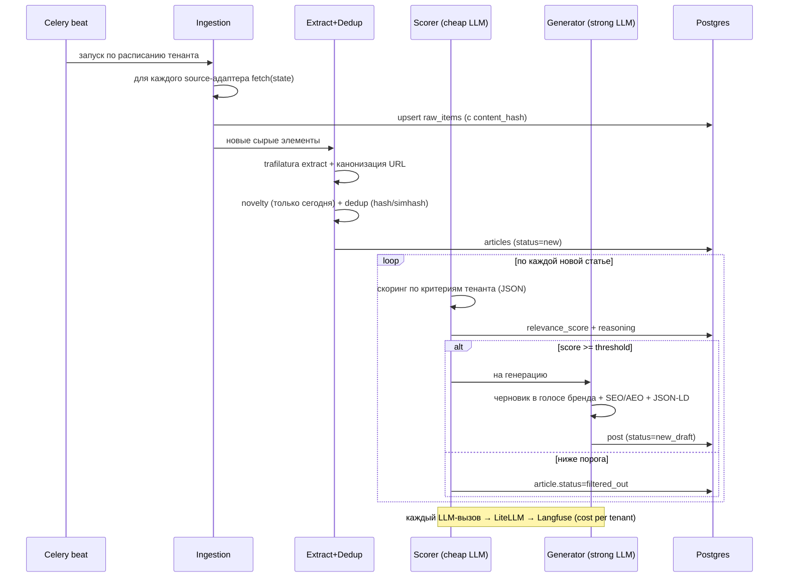

# 03 — Техническая архитектура

> Решения зафиксированы: Next.js + Flowbite React (фронт) + FastAPI (AI/скрапинг), Supabase (Postgres+Auth+RLS), глобальная юрисдикция, биллинг после MVP (метеринг с D1).

## 1. Стек (с обоснованием)

| Слой | Выбор | Обоснование |
|---|---|---|
| Фронт / app | **Next.js 15 App Router + TypeScript + Tailwind + Flowbite Pro (React)** | Flowbite Pro куплен → нативные React-компоненты, server components/actions, деплой Vercel в один пуш |
| AI / пайплайн | **Python 3.12 + FastAPI** (отдельный сервис) | Скрапинг (Crawl4AI, trafilatura, dlt, Scrapy) и LLM-тулинг (Instructor, Pydantic AI) живут в Python. Не воевать с Node |
| БД | **Postgres (Supabase)** | Реляционка + JSONB для гибких полей; RLS = изоляция тенантов в БД |
| Auth | **Supabase Auth** | В комплекте с БД; OAuth + magic link; `auth.uid()` в RLS-политиках |
| Очередь/воркеры | **Celery + Redis** (на стороне FastAPI) | Daily-пайплайн в Python; Celery beat для расписания. (Альтернатива: Trigger.dev, если оркестрировать из Node) |
| LLM-гейтвей | **LiteLLM (self-hosted)** | Virtual keys + hard-бюджеты per-tenant, роутинг моделей, без +5% маркапа |
| LLM-обсервабилити/метеринг | **Langfuse (self-hosted)** | Per-tenant cost через metadata, Daily Metrics API под биллинг |
| Структур. вывод | **Instructor + Pydantic** | Надёжный JSON из LLM с авторетраями |
| Скрапинг | **Crawl4AI** (дефолт) → **Firecrawl** (fallback) → **Bright Data/Zyte** (анти-бот) | Каскад дёшево→дорого |
| Экстракция/дедуп | **trafilatura** (+ datasketch) | Лучшая точность + встроенный SimHash |
| Ingestion backbone | **dlt** (+ Scrapy где нужен краулинг) | Инкрементальная загрузка, state, schema evolution; деплоить нечего |
| Хранилище файлов | **Supabase Storage / S3** | Загрузки профиля (брендбук, примеры) |
| Биллинг (фаза 1.5) | **Stripe Billing** (metered+tiered) | Делает всё нужное; 0.7% объёма |
| Хостинг | Vercel (фронт) + Supabase (БД) + Railway/Fly (FastAPI+Celery+Redis) | ~$40–85/мес MVP |

**Почему два сервиса, а не один Next.js:** скрапинг и LLM-оркестрация в Python-экосистеме сильнее на порядок. Держим чёткую границу: Next.js — это UI + тонкий BFF, который ходит в Postgres и дёргает FastAPI через внутренний API. FastAPI — это «мозг»: ingestion, scoring, generation, metering.

## 2. Карта компонентов



## 3. Daily pipeline (поток данных)



## 4. Интерфейс адаптера источника

Единый контракт, чтобы RSS, скрапер, Telegram, Reddit падали в один пайплайн без переписывания.

```python
# Каноническая модель — единственная, что видит пайплайн ниже ingestion
class Document(BaseModel):
    id: str                      # hash(source_id + canonical_url)
    tenant_id: str
    source_id: str
    source_type: Literal["rss", "scraper", "sitemap", "telegram", "reddit"]
    url: str
    canonical_url: str
    external_id: str | None      # GUID / post id
    title: str
    body: str                    # markdown
    summary: str | None
    language: str | None
    author: str | None
    tags: list[str] = []
    media: list[str] = []        # url картинок
    published_at: datetime       # UTC
    fetched_at: datetime
    content_hash: str
    metadata: dict = {}          # сырьё под конкретный тип источника

class SourceAdapter(Protocol):
    config_schema: type[BaseModel]                 # декларативный конфиг источника
    def fetch(self, state: dict) -> Iterator[Raw]: ...   # инкрементально по курсору
    def normalize(self, raw: Raw) -> Document: ...       # маппинг в Document
    # fetch также возвращает новый state (last_published_at / ETag / since_id)
```

Реестр адаптеров: `{"rss": RssAdapter, "scraper": ScraperAdapter, ...}`. Новый тип источника = новый класс, реализующий Protocol. Backbone — `dlt` (инкрементальность, state, ретраи).

## 5. Схема данных (Postgres)

Все таблицы с `tenant_id` + RLS-политика `tenant_id = auth.jwt() ->> 'tenant_id'` (или через membership-таблицу). Ниже — ядро MVP.

```sql
-- Тенант = компания-клиент
tenants(
  id uuid pk, name text, plan text default 'pilot',
  ai_budget_usd_month numeric, ai_spent_usd_month numeric default 0,
  upsell_threshold_pct int default 80,         -- N% для апселла (настраивает админ)
  created_at timestamptz
)

users(
  id uuid pk,             -- = supabase auth.users.id
  tenant_id uuid fk, email text, role text check (role in ('owner','editor','admin')),
  created_at timestamptz
)

-- Профиль/конфиг тенанта (из онбординга и доков Kate)
brand_profiles(
  id uuid pk, tenant_id uuid fk,
  company_description text,
  audience_description text,
  filter_criteria text,           -- свободный текст «что ищем/отбрасываем»
  voice_config jsonb,             -- тон, обороты
  voice_examples jsonb,           -- [{post_text, source_url, why}] -> few-shot
  files jsonb,                    -- ссылки на загруженные брендбуки/примеры
  updated_at timestamptz
)

sources(
  id uuid pk, tenant_id uuid fk,
  type text,                      -- rss | scraper | sitemap | telegram | reddit
  url text, title text,
  priority int default 3,         -- 1..5 как в доках Kate (уровень доверия)
  category text,                  -- стримвир / бизнес / ресейл / ...
  config jsonb,                   -- пер-источниковый конфиг
  state jsonb,                    -- курсор инкрементальности (ETag/last_pub/since_id)
  enabled bool default true,
  last_run_at timestamptz
)

-- Сырые + извлечённые статьи
articles(
  id uuid pk, tenant_id uuid fk, source_id uuid fk,
  url text, canonical_url text, external_id text,
  title text, body text, summary text, language text,
  author text, tags text[], media jsonb,
  published_at timestamptz, fetched_at timestamptz,
  content_hash text, simhash bigint,
  status text default 'new',      -- new | extracted | filtered_out | scored | drafted
  relevance jsonb,                -- полный объект скоринга (см. 05)
  relevance_score int,            -- денормализованный для сортировки/фильтра
  unique(tenant_id, canonical_url)
)

-- Черновики постов
posts(
  id uuid pk, tenant_id uuid fk, article_id uuid fk,
  title text, body_markdown text,
  faq jsonb, json_ld jsonb,       -- AEO
  seo jsonb,                      -- meta, keywords, headings-инструкции, brand_tie_in
  suggested_titles text[],
  ai_model text, ai_cost_usd numeric,
  status text default 'new',      -- new | in_progress | published | rejected | archived
  created_at timestamptz, updated_at timestamptz
)

-- Обратная связь (фильтрация и черновики) -> в промпты
feedback(
  id uuid pk, tenant_id uuid fk,
  target_type text,               -- 'score' | 'draft'
  target_id uuid,                 -- article_id | post_id
  rating int,                     -- -1 / +1 или 1..5
  edited_diff jsonb,              -- дельта draft->final (высший сигнал)
  comment text, user_id uuid, created_at timestamptz
)

-- Учёт стоимости AI (зеркало Langfuse для быстрых отчётов/апселла)
ai_usage(
  id uuid pk, tenant_id uuid fk, user_id uuid,
  stage text,                     -- 'score' | 'draft'
  model text, input_tokens int, output_tokens int,
  cost_usd numeric, request_id text, created_at timestamptz
)
```

**JSONB там, где гибкость важнее схемы** (voice_examples, relevance, json_ld). Денормализуем `relevance_score` и `status` для индексов сортировки дашборда.

## 6. Cost-metering архитектура

```
App/Pipeline
  → LiteLLM proxy  (virtual key = tenant; hard-бюджет на ключ; роутинг score→cheap / draft→strong)
       → провайдер (OpenAI/Anthropic/Gemini)
       → callback → Langfuse (trace tags: tenant_id, user_id, stage, request_id)
  ночью: Langfuse Daily Metrics API → group by tenant_id → пишем в ai_usage / обновляем tenants.ai_spent_usd_month
  при ai_spent >= upsell_threshold_pct% бюджета → флаг апселла в UI/почте
  (фаза 1.5) ai_usage * markup → Stripe metered usage → инвойс
```

Ключевое: **LiteLLM enforce-ит бюджет** (рантайм-кэп, чтобы клиент не сжёг маржу), **Langfuse считает** (источник правды по $). В Postgres держим зеркало `ai_usage` для быстрых отчётов админки без обращения к Langfuse на каждый запрос.

## 7. Эскиз API (FastAPI)

```
# Ingestion / pipeline (internal, дёргается Celery beat и админкой)
POST  /internal/pipeline/run            {tenant_id}            -> запустить дневной прогон
POST  /internal/sources/{id}/test                            -> проверить адаптер/фид

# Sources & profile (через BFF Next.js)
GET   /tenants/{id}/sources
POST  /tenants/{id}/sources
PATCH /tenants/{id}/sources/{sid}
GET   /tenants/{id}/brand-profile
PUT   /tenants/{id}/brand-profile

# Articles & posts (дашборд)
GET   /tenants/{id}/posts?status=new&sort=newest
GET   /tenants/{id}/posts/{pid}
PATCH /tenants/{id}/posts/{pid}          {body_markdown, status, ...}
POST  /tenants/{id}/posts/{pid}/feedback {rating, edited_diff, comment}
GET   /tenants/{id}/articles/{aid}       -> исходник + объяснение скоринга

# Admin
GET   /admin/tenants                      -> дашборд по всем
GET   /admin/usage?group_by=tenant        -> AI-расходы
PATCH /admin/tenants/{id}                 -> план, бюджет, порог апселла
```

Next.js BFF читает Postgres напрямую (через Supabase client с RLS) для лёгких операций и проксирует «тяжёлое» (запуск пайплайна, тесты источников) в FastAPI.

## 8. Мультитенантность и безопасность

- **Изоляция данных — RLS в Postgres.** Каждая таблица: политика `tenant_id = (current membership)`. authZ пишется один раз в SQL, любой запрос авто-скоупится. Это главный архитектурный выигрыш Supabase для B2B.
- **Изоляция AI-бюджета** — virtual key per tenant в LiteLLM + hard cap.
- **Секреты** — в env/Secrets-менеджере (Railway/Fly secrets, Supabase vault), не в коде.
- **Роли:** `owner` / `editor` (внутри тенанта) + глобальный `admin` (наша админка, обходит RLS через service role — отдельный, аудируемый путь).
- **Скрапинг-этика:** уважение robots.txt, rate-limit, identifiable UA; трансформация, а не копирование чужого контента (см. риски в PRD).

## 9. Инфраструктура и стоимость MVP

| Компонент | Где | ~$/мес |
|---|---|---|
| Next.js фронт | Vercel | $0–20 |
| Postgres + Auth + Storage | Supabase Pro | $25 |
| FastAPI + Celery + Redis | Railway / Fly | $15–41 |
| Скрапинг (RSS бесплатно + Firecrawl кредиты по нужде) | — | $0–30 |
| LiteLLM + Langfuse (self-host рядом с FastAPI) | Railway / Fly | в составе воркера |
| **AI API (переменная, COGS)** | OpenAI/Anthropic/Gemini | зависит от клиентов (см. 06) |
| **Итого инфра (без AI COGS)** | | **~$40–115/мес** |

## 10. Что осознанно НЕ берём в MVP (архитектурно)

- LangChain/LangGraph (DAG линейный — overkill).
- Airbyte/NiFi/Kafka (рано; dlt+Celery достаточно).
- Микросервисный зоопарк (два сервиса: Next.js + FastAPI — и хватит).
- Векторная БД (нужна только если поедем в RAG/семантический дедуп — фаза 2, тогда pgvector в той же Postgres).
- Соцсеть-адаптеры кроме абстракции (Telegram/Reddit — фаза 2).
