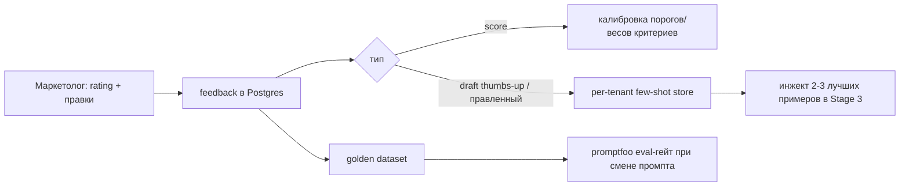

# 05 — AI-пайплайн и промпт-спеки

Документы Kate («Источники модных новостей», «Критерии отбора») — это фактически готовая спека для движков экстракции и скоринга. Ниже они переведены в инженерные артефакты: JSON-схемы, промпт-шаблоны, чеклисты. Спеки **тенант-настраиваемые** — LOOTON просто первая калибровка.

## 1. Архитектура пайплайна

`extract → score → generate → feedback` — линейный DAG с одной развилкой (порог). Без LangGraph. Каждый LLM-вызов: `Instructor + Pydantic` через `LiteLLM` (роутинг + бюджет) с трейсом в `Langfuse` (cost per tenant).

Роутинг моделей:
- **Stage SCORE** — дешёвая модель (Gemini 2.0 Flash-Lite / GPT-nano). Высокий объём, низкая цена.
- **Stage GENERATE** — сильная модель (Claude Sonnet 4.6 / GPT-flagship) или GPT-mini для эконом-тарифа.

## 2. Stage 1 — Extract (экстракция + метаданные)

Из доков Kate (раздел «Что важно сохранять по каждому источнику») — целевые поля экстракции. Часть берётся из источника, часть — лёгкой LLM/правилами.

```python
class ExtractedArticle(BaseModel):
    # из источника / trafilatura
    source_name: str
    url: str
    published_at: datetime
    language: str
    source_category: str          # категория источника (1..10 из доков Kate)
    trust_priority: int           # 1..5 уровень доверия

    # из текста (LLM-обогащение, дешёвая модель)
    topic: str = Field(description="тема новости одной фразой")
    brands: list[str] = Field(description="упомянутые бренды")
    items: list[str] = Field(description="модели/айтемы")
    persons: list[str] = Field(description="вовлечённые персоны")
    news_type: str = Field(description="релиз|коллаборация|назначение|показ|кампания|архив|переиздание|сделка|другое")
    summary: str = Field(description="краткое саммари 2-3 предложения")
    keywords: list[str] = Field(description="ключевые слова для поиска")
    possible_titles: list[str] = Field(description="3-5 возможных заголовков")
```

> Для экономии: поля `brands/items/persons/news_type/summary/keywords/titles` можно вынести в один вызов вместе со скорингом (Stage 2), чтобы не платить дважды. Рекомендую объединить extract-обогащение и scoring в один LLM-вызов на дешёвой модели.

## 3. Stage 2 — Score / Filter (главный движок)

### 3.1 Схема скоринга (из «Критериев отбора» Kate)

Каждый критерий — балл low/medium/high (маппим в 0/50/100 или 1–3) + общий взвешенный скор + приоритет публикации.

```python
class CriterionScore(BaseModel):
    reasoning: str = Field(description="ПОЧЕМУ такой балл — пиши ДО score")
    score: Literal["low", "medium", "high"]

class RelevanceScore(BaseModel):
    # сначала рассуждение по каждому критерию (из доков Kate)
    news_potential: CriterionScore          # новостной потенциал
    resale_potential: CriterionScore         # ресейл-потенциал
    commercial_potential: CriterionScore     # коммерческий потенциал для платформы
    trend_potential: CriterionScore          # трендовый потенциал
    trend_explanation: str = Field(description="какой именно тренд подтверждает/запускает")
    seo_potential: CriterionScore            # SEO-потенциал
    aeo_potential: CriterionScore            # AEO-потенциал
    content_potential: CriterionScore        # сколько форматов контента
    content_cluster_potential: CriterionScore # потенциал кластера (5+ материалов)
    knowledge_gap_potential: CriterionScore  # закрывает ли пробел в знаниях
    unique_angle: CriterionScore             # уникальный угол платформы (ресейл/архив/винтаж)

    # агрегат
    overall_score: int = Field(ge=0, le=100, description="взвешенная итоговая релевантность")
    publication_priority: Literal["HOT", "WARM", "COLD", "DROP"]
    passes_threshold: bool
    decision_summary: str = Field(description="1-2 предложения: почему берём/не берём")
```

Веса критериев — конфиг тенанта (для LOOTON ресейл/коммерческий/уникальный угол весят больше). Порог `passes_threshold` и минимальный `publication_priority` — настройка тенанта.

### 3.2 Промпт-шаблон скоринга

```
SYSTEM:
Ты — главный редактор и маркетинг-директор бренда {company_name}.
{company_description}
Твоя аудитория: {audience_description}.

Критерии отбора этого бренда (что берём, что отбрасываем):
{filter_criteria}        # ← свободный текст из профиля; для LOOTON = их «Критерии отбора»

Твоя задача — оценить новость по критериям ниже и решить, стоит ли делать
из неё контент. Бренду интересны не просто модные новости, а инфоповоды,
после которых аудитория может захотеть найти, купить, продать, обсудить
или переоценить вещь из новости.

Оцени по каждому критерию (low/medium/high) с обоснованием ПЕРЕД баллом:
- Новостной потенциал, Ресейл-потенциал, Коммерческий потенциал,
  Трендовый (+ какой тренд), SEO, AEO, Контентный, Контентный кластер,
  Knowledge Gap, Уникальный угол бренда.
Затем — итоговый скор 0-100, приоритет HOT/WARM/COLD/DROP, решение.

USER:
Источник: {source_name} (приоритет доверия {trust_priority}, категория {source_category})
Заголовок: {title}
Дата: {published_at}
Текст: {body}

→ верни строго RelevanceScore (JSON).
```

Правила надёжности (из ресёрча): `reasoning` ПЕРЕД `score` (chain-of-thought), enum вместо свободного текста, `description` на каждое поле, нативный structured output через Instructor, авторетрай на ошибке валидации.

## 4. Stage 3 — Generate Draft (голос бренда + SEO/AEO)

### 4.1 Схема черновика — тело и JSON-LD одним ответом

```python
class FAQItem(BaseModel):
    question: str
    answer: str = Field(description="прямой ответ 40-60 слов")

class DraftPost(BaseModel):
    language: str
    title: str
    suggested_titles: list[str] = Field(min_length=3)
    meta_description: str = Field(max_length=200)
    body_markdown: str = Field(description="answer-first, H2/H3, короткие абзацы, списки")
    faq: list[FAQItem] = Field(description="реальные Q&A как спрашивают пользователи")
    keywords: list[str]
    entities: list[str] = Field(description="люди/бренды/модели/места явно")
    brand_tie_in: str = Field(description="угол симбиоза «инфоповод × бренд»")
    seo_instructions: str = Field(description="что прописать в разметке/семантике")
    json_ld: dict = Field(description="schema.org Article + FAQPage + BreadcrumbList")
```

### 4.2 Промпт-шаблон драфтинга

```
SYSTEM:
Ты пишешь черновик статьи/поста для бренда {company_name} в его фирменном голосе.
{company_description}
Аудитория бренда: {audience_description}.

Голос и тон: {voice_config}
Речевые обороты и стиль — следуй этим примерам реальных постов бренда. У каждого примера
указан инфоповод-источник, из которого он родился — учись связке «инфоповод → пост»:
{voice_examples}        # few-shot: [{post_text, source_url, why}] — 2-3 лучших, source_url в промпт

Задача: на основе новости написать материал-симбиоз «инфоповод × бренд».
Это НЕ пересказ новости. Органично вплети инфоповод в бренд — его позиционирование,
экспертизу и угол ({unique_angle_hint} — напр. ресейл/архив/винтаж/редкость/стоимость) —
и добавь собственную ценность для аудитории. В поле brand_tie_in объясни угол симбиоза:
почему этот инфоповод работает на этот бренд.

Требования к SEO/AEO (обязательно):
- answer-first: каждый раздел начинается с прямого ответа 40-60 слов;
- логичная иерархия H1/H2/H3; короткие абзацы, списки, таблицы;
- секция FAQ с реальными вопросами аудитории;
- явные сущности (бренды, модели, персоны) — не местоимения;
- сгенерируй JSON-LD (Article + FAQPage), строго соответствующий видимому тексту.

USER:
Новость: заголовок «{title}», источник {source_name} ({url}), дата {published_at}.
Релевантность (почему берём): {decision_summary}; тренд: {trend_explanation}.
Текст новости: {body}

→ верни строго DraftPost (JSON).
```

### 4.3 Чеклист SEO/AEO (валидируем на выходе)
- [ ] Один H1, логичные H2/H3.
- [ ] Answer-first в начале каждой секции (40–60 слов).
- [ ] FAQ-секция с реальными Q&A.
- [ ] Явные entities в прозе.
- [ ] Короткие абзацы / списки / таблицы.
- [ ] `Article`/`NewsArticle` JSON-LD: headline, author(+URL), datePublished, dateModified, publisher, image, mainEntityOfPage.
- [ ] `FAQPage` JSON-LD, совпадает с видимой FAQ (высший AEO-рычаг).
- [ ] `BreadcrumbList`, canonical URL, meta description, OpenGraph.
- [ ] Размечаем только видимый контент (иначе хуже, чем без схемы).

## 5. Stage 4 — Feedback loop



- **Высший сигнал** — дельта между сгенерированным черновиком и финальной правкой (`edited_diff`).
- **MVP:** копим фидбэк + ручной инжект лучших примеров в few-shot.
- **Фаза 2:** авто-eval-цикл (promptfoo/Langfuse evals): новый промпт катим, только если скоры на golden dataset не упали.

## 6. Объединение вызовов ради экономии

Рекомендуемая раскладка вызовов на статью:
1. **Вызов A (дешёвая модель):** extract-обогащение + scoring в одном structured-выводе → `ExtractedArticle + RelevanceScore`. ~$0.0003.
2. **Вызов B (сильная модель), только если passes_threshold:** генерация `DraftPost`. ~$0.005–0.04.

Так платим за дорогую модель только на прошедших отбор (обычно 5–20% потока). Это ядро юнит-экономики ([06_pricing_unit_economics.md](/06_pricing_unit_economics.md)).

## 7. Цена за операцию (актуально апрель 2026)

| Операция | Токены | Дешёвая модель | Сильная модель |
|---|---|---|---|
| Скоринг+обогащение | ~2k in / 250 out | ~$0.0003 (Flash-Lite/nano) | — |
| Генерация черновика | ~3k in / 2k out | ~$0.005 (GPT-mini) | ~$0.039 (Sonnet 4.6) |

Output дороже input в 4–8× → агрессивно лимитируй `max_output_tokens`. Закладывай +30–50% на ретраи и рост few-shot.
